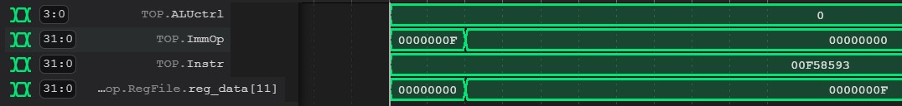
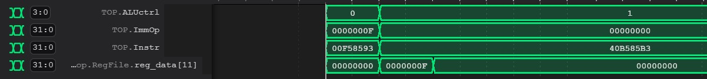
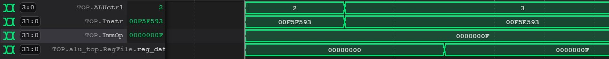
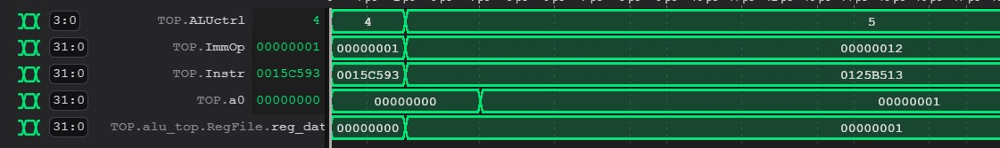
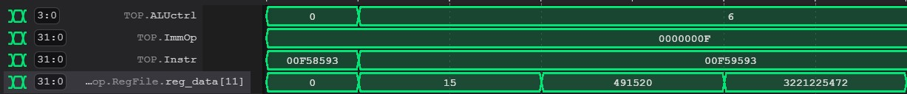
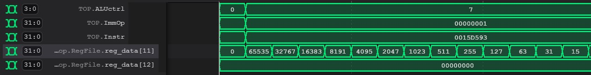
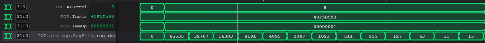
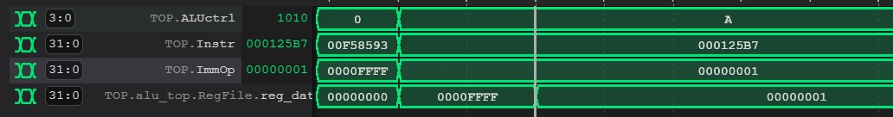

# Logbook: Arithmetic Logic Unit

## Basic Info 
* Author : Bharathaan Sukumaran
* Date : 15 December 2022
* Objective:
     * Upgrade ALU from Lab 4 (4 operations) to carry out all arithmetic logic operations (9 operations)
    * Adjusting existing register file to new instructions

## Initial Design Decisions

Given that 9 distinct instructions couldn't be carried out with the exisiting 3-bit ALUControl signal, it was upgraded to a 4-bit signal. The specifications are as follows:

**Table 1: `ALUControl`**

| Code | Operation | 
| :--- | :-------- |
| 0b0000 | Add |
| 0b0001 | Subtract|
| 0b0010 | Bitwise And|
| 0b0011 | Bitwise Or|
| 0b0100 | Bitwise Xor|
| 0b0101 | Set Less Than|
| 0b0110 | Shift Left Logical|
| 0b0111 | Shift Right Logical|
| 0b1000 | Shift Right Arithmetic|
| 0b1001 | Jump and Link Register|
| 0b1010 | Load Upper Immediate |

## Testing and Results

### Testing
The [alu.sv](../source/alu/alu.sv) module was tested with the register file using the [ALU top-level file](../source/alu/alu_top.sv) and it's [testbench](../testbench/alu/alu_tb.cpp) to simulate the following conditions:

**Table 2: `Testing Conditions`**

| Instruction | ALUsrc | ALUctrl | ImmOp  | Machine Code | RegWrite |
|-------------|--------|---------|--------|--------------|----------|
| add         | 1      | 0b0000  | 0b1111 | 0x00f58593   | 1        |
| sub         | 1      | 0b0001  | 0b1111 | 0x40b585b3   | 1        |
| andi        | 1      | 0b0010  | 0b1111 | 0x00f5f593   | 1        |
| ori         | 1      | 0b0011  | 0b1111 | 0x00f5e593   | 1        |
| xori        | 1      | 0b0100  | 0b1111 | 0x00f5c593   | 1        |
| slti        | 1      | 0b0101  | 0b1111 | 0x00f5a593   | 1        |
| slli        | 1      | 0b0110  | 0b1111 | 0x00f59593   | 1        |
| srli        | 1      | 0b0111  | 0b1111 | 0x00f5d593   | 1        |
| srai        | 1      | 0b1000  | 0b1111 | 0x40f5d593   | 1        |
| jalr        | 1      | 0b1001  | 0b1111 | 0x00f585e7   | 1        |
| lui         | 1      | 0b1010  | 0b1111 | 0x000125b7   | 1        |


### Results

The results of the testing follow the order in the table:

1. Add Operation

    

    * The program added the value of ImmOp to the value from register a1 and assigned it to a1


        ```assembly
        addi a1, a1, 0xF
        ```
2. Sub Operation

    

    * The program added the value of ImmOp to the value from register a1 and assigned it to a1.

    * The program then subtracted the value of ImmOp from the value of a1 and then assigned it to a1


        ```assembly
        addi a1, a1, 0xF
        sub a1, a1, 0xF
        ```

3. Bitwise And Operation and Or Operation

    

    * The program carried oot bitwise and on the value of ImmOp and the value from register a1 and assigned it to a1

    * The program then carried out bitwise or on the value of ImmOp and the value from register a1 and then assigned it to the value of a1

    * The program worked as expected because a bitwise and operation between the two values produced a zero output because the value of a1 was zero. The bitwise or operation with zero would output the number itself and that was observed in the testing


        ```assembly
        andi a1, a1, 0b1111
        ori a1, a1, 0b1111
        ```

4. XOR and Set Less Than operation
    
    

    * The program XOR the value of a1 with the ImmOp

    * The program compared the value in a1 to ImmOp and then set the alue of a0 to the boolean of that condition


        ```assembly
        xor a1, a1, 0xF
        slti a0, a1, 0x12
        ```

5. Shift Left Logical Operation

    

    * The program shifted the value in a1 by the value specified by ImmOp

    * Shifting the value to the left is an equivalent of multiplying by two. In this case the value was multiplied by $2^{15}$ each time the loop was executed. 


        ```assembly
        addi a1, a1, 0xF
        slli a1, a1, 0xF
        ```
6. Shift Right Logical Operation

    

    * The program shifted the value in a1 to the left by the value specified by ImmOp

    * Shifting the value to the left is an equivalent of multiplying by two. In this case the value was divided by 2 each time the loop was executed. 


        ```assembly
        addi a1, a1, 0xFFFF
        srli a1, a1, 0xF
        ```

7. Shift Right Arithmetic Operation

    

    * The program shifted the value in a1 to the right by the value specified by ImmOp

    * Shifting the value to the left is an equivalent of multiplying by two. In this case the value was multiplied by $2^{15}$ each time the loop was executed. 


        ```assembly
        addi a1, a1, 0xFFFF
        srai a1, a1, 0xF
        ```

8. Load Upper Immediate Operation

    

    * The ALU was configured to output the immediate directly from the sign extension unit

    * ImmOp was not initialised as 0x12 but the ALU loaded the value of ImmOp that was initiliased to the register

        ```assembly
        addi a1, a1, 0xFFFF
        lui a1, a1, 0x12
        ```

## Challenges

1. **Difficult to test if JALR works without building entire CPU**
    * Testing the ALU on its own did not show clearly that it would work as intended in the overall CPU

2. **Incorrect Understanding of SLT operation**
    * It was assumed that verilator would be abke to differentiate between signed and unsigned operators as shown in the [previous version](https://github.com/EIE2-IAC-Labs/iac-riscv-cw-24/commit/e68b909bdf4efa3885f3dd485cac15468876e06a)but was fixed in [latest version](../source/alu/alu.sv)

3. **Debugging with reference program**
    * It was noticed that the zero was getting overwritten due to the RET instruction so the register file was modified to not load anything into the zero register
