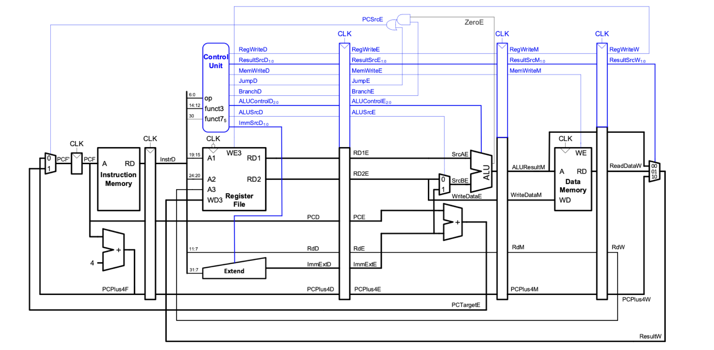

# Logbook: Control Unit & Sign Extension Unit

## Basic Info

* Author: Samuel Wang, Bharathaan Sukumaran (co-author)
* Date: 16 Dec 2022
* Objective: 
  * Create Control Unit component that output control signals for the processor.
  * Create Extend component that sign extends immediate operands according to control signals.
  * Create a [specification documentation](./Specs.md) for operation for each signal.

## Results (Control Unit)

### 2022 DEC 08 (v1): F1 Program Instructions -- Samuel [^1] [^2]

Eight instructions were recognized to be absolutely neccesary to the F1 Program: `add`, `xor`, `sw`, `addi`, `slli`, `lw`, `bne`. The input and output ports were then decided from the diagram provided from the textbook in the lectures (Figure 1). The output signals were then determined and implemented.

|  |
| :------------------------------------------------------: |
| Figure 1: Control Unit Signals                                |

For `ALUControl` signals, see specification sheet for details.

Note that since we only picked one branch instruction to implement, the `Branch` signal is only 1 bit.

Jump instructions, `jal` and `jalr`, were only added later due to misunderstanding of the project brief.

### 2022 DEC 08 (v2): Jumps -- Bharathaan

Jump instructions, `jal` and `jalr`, were later added. The `Jump` signal is set to high when jump instructions are fetched. The `Branch` signal is then used to differ between the two jumps; `Branch` is high for `jalr` and low for `jal`.

### 2022 DEC 09 (v3): Byte Data Addressing -- Samuel

Byte addressing was later added to the control unit. An additional signal, `B`, was used to denote if the operation was for byte or not. `B` was high for `lb`, `sb`, and `lbu`; otherwise low.

## Result (Sign Extension)

Sign extend operations (the `ImmSrc` control signal) was internally set, see Table 1 for signal and operations. 

Table 1: `ImmSrc`
| Code | Operation | Input | Output |
| :--- | :-------- | :---- | :----- |
| 0b000 | Sign Extend I-type | 12-bit Signed | 32-bit Signed |
| 0b001 | Sign Extend B-type | 12-bit Signed | 32-bit Signed |
| 0b010 | Sign Extend S-type | 12-bit Signed | 32-bit Signed |
| 0b010 | Sign Extend J-type | 12-bit Signed | 32-bit Signed |
| 0b100 | Extend Lower 0s U-type | 12-bit Unsigned | 32-bit Unsigned |
| Else | NULL | N/A | 32'd0 |

## Challenges

No significant challenge was met when building the control unit or sign extension unit.

## Testbench

A simple top level ([control_unit_top.sv](../source/ctrl/control_top.sv)) to connect the control unit and the sign extension unit was written to test the designs. A testbench ([control_unit_top_tb.sv](../testbench/ctrl/control_top_tb.cpp)) that inputs one instruction was created to test the design instruction by instruction.

[^1]: Control signals were only implemented for instructions needed in F1 program (Branch Version).

[^2]: Await publication of reference program to add new instructions.
