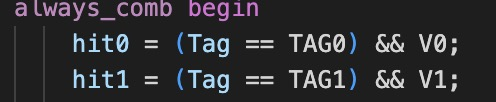
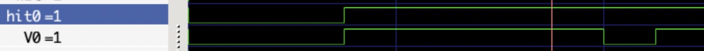

# Logbook: Data Cache

## Basic Info

* Author: Chenglin Sun, Qidong Zhou
* Date: 15 Dec 2022
* Objectives:  
  * Create a one-way write-through data cache.
  * Modify data memory to work with the cache design.
  * Link cache and data memory together in a top module, and generate hit/stall signals inside.

* Special note: While developing the cache, we also created two versions of data cache that we ended up not using. The first one is a two-way cache that did not meet the requirements for a realistic data cache. The second one is a two-way write-back version that we didn't have time to debug and is not fully fucntional. Details of these two versions are discussed below.

## Data Cache

* The data cache has 11 inputs and 3 outputs. 
* The inputs are:
  * clk, clock signal
  * WEE, write enable from outside
  * hit, hit signal
  * address is splitted into tag, set_num and block_offset
  * DATA_IN, write data from outside
  * DATA_IN_0 - DATA_IN_3, write data from data memory

* The outputs are:
  * TAG, TAG corresponding to the data being stored in the cache
  * V, Valid bit for the current set
  * DATA_OUT, read data

* Internally there are 4 data registers, each of size 8, and keeps 32-bit data. Here 4 words of data form a block. There are 8 blocks in total. The size of the cache is 128 bytes.

* There is also a valid_reg and tag_reg to stored valid bit and tag for each set.

* Address is splitted in the following way:
  * tag = Address[31:7]
  * set_num = Address[6:4]
  * block_offset = Address[3:2]
  * byte_offset = Address[1:0] note: not used in data cache

* There are two modes of writing data. The first mode is used when WEE is high. This means we write external data to the cache. We only write one word here, so the exact location to write is decided by referring to block_offset and set_num.

* The other mode of writing is when WEE is low, and hit is low as well. This indicates that the outside is trying to read data, but couldn't find it the cache (not hit). This means the data will be coming from the data memory in a block of 4 words. So 4 words of data is written simultaneously.

* Every time a write happens, tag_reg and valid_reg will be updated accoridngly at the set_num

* Simulation and testing:
  * The test program tests both writing modes for the cache.

||
|:--:|
|Figure 1 : Data Cache Waveform|

## Modified Data Memory

* This data memory is modified based on the data memory without cache.
* Writing to the data memory stays the same, major changes are in the reading part.
* The changes are:
  * Changes to the output: instead of having one RD, we now have RD0-RD3. Due to the fact that we never directly take RD from data memory to the outside, we do not need a separate RD and all four read data is sent to the cache to be stored.
  * Although we have four outputs, we only need one address input. This is because we can construct four required addresses from the single address, by changing the block_offset from 2'b00 to 2'b11. Four internal addresses is hence added.
  * Now the read process happens for all four addresses.

## Top Level Desgin

* Here is a top level design schematic for this one-way write_through cache.

||
|:--:|
|Figure 1 : One-Way Cache Top Level|

* Inputs at top level are:
  * clk, clock signal
  * A, address
  * B, enable signal for byte-addressing
  * M, represents if instructions is memory_related, enable for stall
  * WE, write enable
  * WD, write data

* Outputs are:
  * RD, read data
  * stall, stall signal

* Hit is calculated in the top level by:
  * hit = (A[31:7] == TAG) & V
  * Two conditions: Tag matches and set is valid.

* Stall is derived from hit, but only when M is high. This is when the instruction is memory-related and now stall = !hit. When M is low, that is, the instruction is not memory-related, stall always stays at 0.

* Waveform for the complete cached data memory:
  * Data write and read are successful, stall signal is high where needed.

||
|:--:|
|Figure 2 : One-Way Cache Top Waveform|

## Original Two-Way Cache Design

The Advanced instruction of cache implements 2-way cache with dirty bit which saves more time on storing data and largely decrease the miss rate of the cache. The basic instruction is shown below in figure 3.

||
|:--:|
|Figure 3 : 2-way cache top level design|

**1. Difference in Instruction**

* The instruction of 2-way allows more data inside the data memory which share the same set number but different addresses to be stored at the same time. This change decrease the miss rate by avoiding the continous replacements in the same set caused by the program. 

* The usage of dirty bit reduces the frequncy of storing data into the data memory, because there is no direct input linked to the data memory and only when the data that is going to be replaced in the cache will be stored. This saves time on unecessary stores into the data memory. 

* The additional U (Least Recent Use) is used to storing the data in order in 2-way instruction. The least recent used data will always be replaced fisrt.

**2. Explaination of Program of additional components**

### Additional WE Signals

The table 1 below illustrates different situations the cache may meet when there are memory instructions. These situations have different write enables to control the data storage in cache as well as the data memory. The not exist cases present because hit can not be 1 when the valid bit is 0.

* The Data_Mem_WE is 1:
  * There is a load instruction, but the valid data store inside the cache misses the desired address, so this data is needed to be stored in the data memory for possible future usage.
  * The store instruction is going to replace the valid data when the cache misses.

* The cache_WE_write_back is 1:
  * The miss happened (V is either 1 or 0) when there is a load instruction, the cache needs to reload the data from the data memory.

From this table, we can work out the logic operation from inputs and outputs to get two WE signals:

1. Data_Mem_WE = V & !hit
2. cache_WE_write_baCK = !WE & !hit  

Table 1: Truth Table for WEs
|Case|WE|V|hit|Data_Mem_WE|cache_WE_write_back|
|----|--|-|---|-----------|--------|
|load&miss|0|0|0|0|1|
|not exist|0|0|1|--|--|
|load&miss|0|1|0|1|1|
|load&hit|0|1|1|0|0|
|store&empty cache|1|0|0|0|0|
|not exist|1|0|1|--|--|
|store&miss|1|1|0|1|0|
|store&hit|1|1|1|0|0|

### Additional U

The U bit or the least recent use bit record the index of the way which stores the oldest data. When a store instruction happened and both ways of the same set number are full, the new data is always to replace the one depending on the U bit instead of the random order. Therefore, the U bit flips when there is a store into the cache.

### Additional Dirty Bit

The dirty bit owns information about origin of the data stored in the cache, which means we can know whether data is from the outside of the cache or from the data memory. Only data that is from the outside is needed to be store into the memory when there is a replacement, because these which is originated from the memory can be write back to the cache.

In the program, the dirty bit exists as a register which store bits for different sets. The bit changes to 1  when the data is from outside of the cache and to 0 when it is from the memory. This dirty bit is logically ANDed with the Data_Mem_WE memtioned in Assitional WE Signals to be the final Write Enable signal for the memory.

## Challenges encountered

* Challenges in designing:
  * We initially started with a two-way design. The control signal evaluation can get quite complicated. But we had several brainstormings and overcame it.
  * Initially we had misunderstandings about the cache design. For example, we thought external write data only goes to data memory, and cache is just for external read. We also thought read data can go directly from data memory to output, before being stored in the cache. This was made clear by talking with our teammates.
  * After knowing how a real-world cache would look like, we had more complicated challenges. Such as adding stall signal, implementing LRU, providing WE for data memory at the right time. We managed to come up with a version that made sense to us.
* Challenges in debugging:
  * The main reason we did not manage to finish the two-way write-back design is that debugging became really difficult, due to strange behaviours in the waveform.
  * One major issue is that at times there can be a weird delay coming from combinational logic. And sometimes the waveform does not make sense for what we wrote in the sv file.
  * Below is an example that demonstrates one of these weird behaviours. Hit0 did not go down as V0 went down, which does not make sense. We eventually ran out of time and compromised by creating a one-way write-through cache instead.

||
|:--:|
|Figure 4 : Combinational logic statements|

||
|:--:|
|Figure 5 : Waveform|