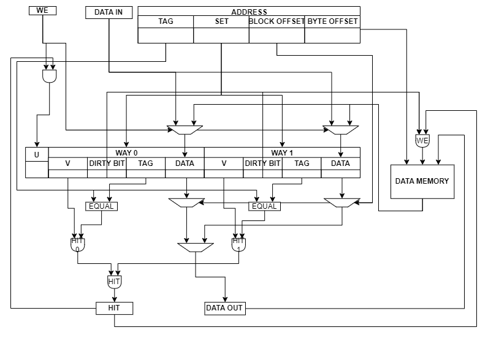

# Logbook: Data Cache

## Basic Info

* Author: Chenglin Sun, Qidong Zhou
* Date: 15 Dec 2022
* Objectives:  
  * Create a one-way write-through data cache.
  * Modify data memory to work with the cache design.
  * Link cache and data memory together in a top module, and generate hit/stall signals inside.

* Special note: While developing the cache, we also created two versions of data cache that we ended up not using. The first one is a two-way cache that did not meet the requirements for a realistic data cache. The second one is a two-way write-back version that we didn't have time to debug and is not fully fucntional. Details of these two versions are discussed below.

## Data Cache

## Modified Data Memory

## Top Level Desgin

## Original Two-Way Cache Design

## Two-Way Write-Back Cache Design

The Advanced instruction of cache implements 2-way cache with dirty bit which saves more time on storing data and largely decrease the miss rate of the cache. The basic instruction is shown below in figure 1.

||
|:--:|
|Figure 1 : 2-way cache instruction|

The instruction of 2-way allows more data inside the data memory which share the same set number but different addresses to be stored at the same time. This change decrease the miss rate by avoid 