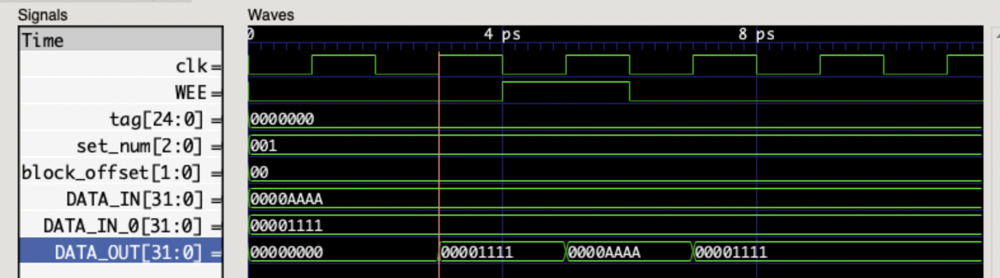
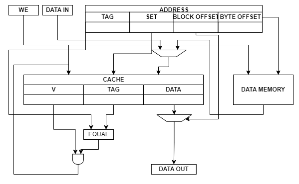
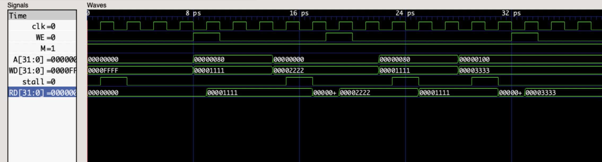

# Logbook: Data Cache

## Basic Info

* Author: Chenglin Sun, Qidong Zhou
* Date: 15 Dec 2022
* Objectives:  
  * Create a one-way write-through data cache.
  * Modify data memory to work with the cache design.
  * Link cache and data memory together in a top module, and generate hit/stall signals inside.

* Special note: While developing the cache, we also created two versions of data cache that we ended up not using. The first one is a two-way cache that did not meet the requirements for a realistic data cache. The second one is a two-way write-back version that we didn't have time to debug and is not fully fucntional. Details of these two versions are discussed below.

## Data Cache

* The data cache has 11 inputs and 3 outputs. 
* The inputs are:
  * clk, clock signal
  * WEE, write enable from outside
  * hit, hit signal
  * address is splitted into tag, set_num and block_offset
  * DATA_IN, write data from outside
  * DATA_IN_0 - DATA_IN_3, write data from data memory

* The outputs are:
  * TAG, TAG corresponding to the data being stored in the cache
  * V, Valid bit for the current set
  * DATA_OUT, read data

* Internally there are 4 data registers, each of size 8, and keeps 32-bit data. Here 4 words of data form a block. There are 8 blocks in total. The size of the cache is 128 bytes.

* There is also a valid_reg and tag_reg to stored valid bit and tag for each set.

* Address is splitted in the following way:
  * tag = Address[31:7]
  * set_num = Address[6:4]
  * block_offset = Address[3:2]
  * byte_offset = Address[1:0] note: not used in data cache

* There are two modes of writing data. The first mode is used when WEE is high. This means we write external data to the cache. We only write one word here, so the exact location to write is decided by referring to block_offset and set_num.

* The other mode of writing is when WEE is low, and hit is low as well. This indicates that the outside is trying to read data, but couldn't find it the cache (not hit). This means the data will be coming from the data memory in a block of 4 words. So 4 words of data is written simultaneously.

* Every time a write happens, tag_reg and valid_reg will be updated accoridngly at the set_num

* Simulation and testing:
  * The test program tests both writing modes for the cache.

||
|:--:|
|Figure 1 : Data Cache Waveform|

## Modified Data Memory

* This data memory is modified based on the data memory without cache.
* Writing to the data memory stays the same, major changes are in the reading part.
* The changes are:
  * Changes to the output: instead of having one RD, we now have RD0-RD3. Due to the fact that we never directly take RD from data memory to the outside, we do not need a separate RD and all four read data is sent to the cache to be stored.
  * Although we have four outputs, we only need one address input. This is because we can construct four required addresses from the single address, by changing the block_offset from 2'b00 to 2'b11. Four internal addresses is hence added.
  * Now the read process happens for all four addresses.

## Top Level Desgin

* Here is a top level design schematic for this one-way write_through cache.

||
|:--:|
|Figure 1 : One-Way Cache Top Level|

* Inputs at top level are:
  * clk, clock signal
  * A, address
  * B, enable signal for byte-addressing
  * M, represents if instructions is memory_related, enable for stall
  * WE, write enable
  * WD, write data

* Outputs are:
  * RD, read data
  * stall, stall signal

* Hit is calculated in the top level by:
  * hit = (A[31:7] == TAG) & V
  * Two conditions: Tag matches and set is valid.

* Stall is derived from hit, but only when M is high. This is when the instruction is memory-related and now stall = !hit. When M is low, that is, the instruction is not memory-related, stall always stays at 0.

* Waveform for the complete cached data memory:
  * Data write and read are successful, stall signal is high where needed.

||
|:--:|
|Figure 2 : One-Way Cache Top Waveform|

## Original Two-Way Cache Design

## Two-Way Write-Back Cache Design

The Advanced instruction of cache implements 2-way cache with dirty bit which saves more time on storing data and largely decrease the miss rate of the cache. The basic instruction is shown below in figure 1.

||
|:--:|
|Figure 1 : 2-way cache instruction|

The instruction of 2-way allows more data inside the data memory which share the same set number but different addresses to be stored at the same time. This change decrease the miss rate by avoid 

## Challenges encountered