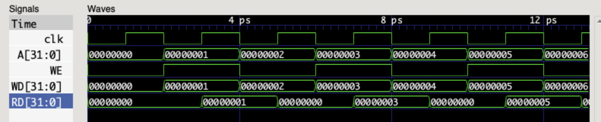

# Logbook: Data Memory
## Basic Info

* Author: Chenglin Sun
* Date: 15 Dec 2022
* Objective: 
  * Create a 32-bit x 32-bit data memory that has asynchronous read and synchronous write.
  * Incorporate byte addressing.

## Result

The data memory has 3 parameters, 5 inputs and 1 output. 

Parameters are: 

* WORD_WIDTH = 8
* ADDR_WIDTH = 17
* DATA_WIDTH = 32

Inputs are:

* clk, clock signal
* [DATA_WIDTH-1:0] A, address
* B, toggle for byte addressing
* WE, write enable
* WD, write data

Output is:

* [DATA_WIDTH-1:0] RD, read data

Internally, we have a register that acts as the memory. It is:

* [WORD_WIDTH-1:0] data [2**ADDR_WIDTH-1:0]

Note that in the data memory, the parameter ADDR_WIDTH refers to the address for the internal byte-addressing-compatible data register. Due to byte addressing, data is stored in 8-bit words in the internal data register.

When WE is 0, we read data from the data memory. This is achieved by;
* assign RD = {data[A[ADDR_WIDTH-1:0]+3], data[A[ADDR_WIDTH-1:0]+2], data[A[ADDR_WIDTH-1:0]+1], data[A[ADDR_WIDTH-1:0]]};

A 32-bit data is stored as 4 consecutive words in the internal data register.

When WE is 1, we write to the data memory. There are 2 cases to consider:
* If B = 0, that means byte write is not used. So WD is segmented into 4 parts, each of size 8-bit. These 4 segments are fed into the data memory at 4 consecutive locations.
* If B = 1, byte write is used. Only WD[7:0] is read into the single location in the data register corresponding to the current address.

The write process happens at positive edge of clock only.

## Challenges

There was not much challenge in writing the data memory. The main challenge stems from the byte addressing and how to adjust the inputs, outputs and internal data register accordingly. After a bit of calculations this challenge was overcome.

## Appendix: Waveform

* The test program writes to the data memory every other cycle. This tests both write and read of our data memory.

||
|:--:|
|Figure 1 : Data Memory Test