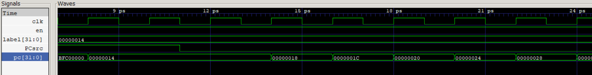

# Logbook: Program Counter & Instruction Memory

## Basic Info

* Author: Qidong Zhou
* Date: 15 Dec 2022
* Objevtives:
    * create an instruction memory 
    * create a program counter

## Result

**1. PC counter**

The PC counter should inscrese by 4 each cycle and the start with the address of 0xBFC00000 which is specified by the memory map.

Test Bench:

||
|:--:|
|Figure 1 : pc counter test|

The initial output of 0xBFC00000 is caused by the reset signal of 1, then output jumps to 0x00000014 because of the PCsrc of 1 which implements the branch instruciton, finally the output do the normal increse of 4 addresses. ALL behaves as expected. Shown in the figure 1.

**2. Instruction Memory**

The instruction memory is designed to hold 2^12 address instead of fully using all 2^32 addresses. The address input only choose the last 12 bits of the output from the pc counter.

The instruction memory using the Byte addressing which means only one byte is stored in each address, therefore the desired instruction is produced by linking bytes stored in four consecutive addresses. 
