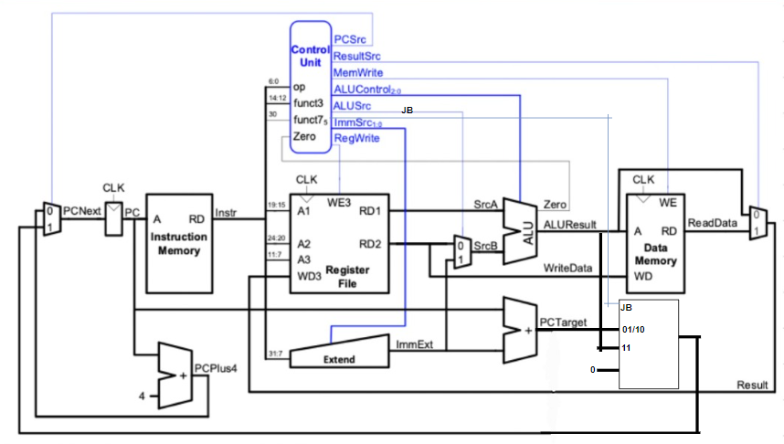
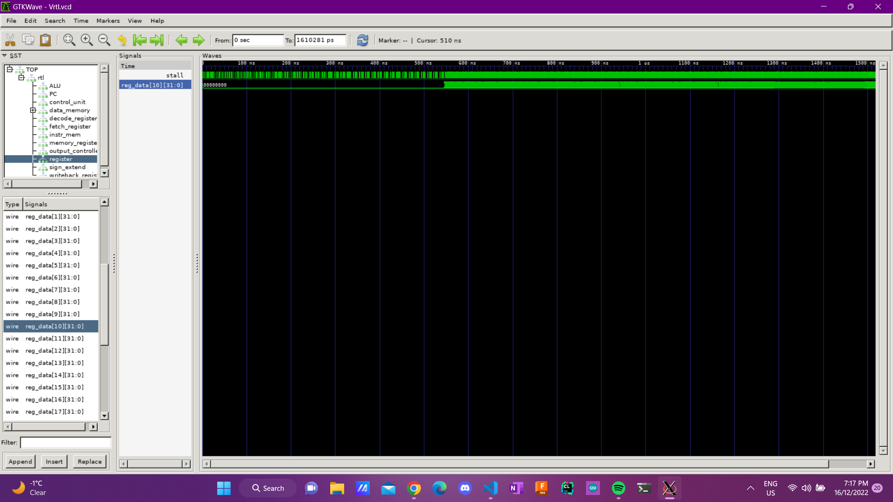

# Logbook: Top Level

## Basic Info 
* Author : Bharathaan Sukumaran
* Date : 15 December 2022
* Objective:
    * Link all individual components
    * Test top-level file with reference program and f1 program

## Design Decisions

The only deviation from the blueprints provided in the lecture slides was an additional 2-bit multiplexer to perform JAL and JALR instructions with a select signal using the control signal that used the concatenation of the Jump and Branch signal from the ALU.

**Table 1: `Branch, JAL and JALR Logic`**

| Instruction            | Jump_Branch | Value Selected  |
|------------------------|-------------|-----------------|
| Branch                 | 01          | PC+ImmOp        |
| Jump and Link          | 10          | PC+ImmOp        |
| Jump and Link Register | 11          | SUM(ALU Result) |

## Results

### Single Cycle
Minor errors in modules but ran F1 program and Reference program successfully once resolved.

### Pipelined
No errors with modules but it was noticed that branch and jump instructions were executed one cycle later. Once resolved, both F1 program and reference program was executed succesfully.

###  Cached-Pipelined CPU
Stalls were added to all pipeline registers and the program counter. Minor errors with cache signals. Once resolved, F1 program was run succesfully but reference program was not run succesfully.

Some deductions that were made from the wave diagram:
 * Stalling might causes delays in incrementing the value of a0 so the display is printing the same value of a0 for a longer time
 * Cache block might not fetching data correctly from memory
 * Cache block might not writing data into the correct memory locations

Unfortunately, these issues could not be resolved in time to make it work for the reference program.

## Challenges
1. Debugging by hand/wavetracing
    * It was difficult to pinpoint the exact location of the error without inspecting which instruction was being executed wrongly

2. Difficult to debug memory related instructions
    * It was difficult to check if the right values were being stored into the right locations in the data cache

3. Difficult to integrate all designs
    * It was difficult to put together the top level because individual designs had errors in them. This took up more time than what was needed to put together top level

