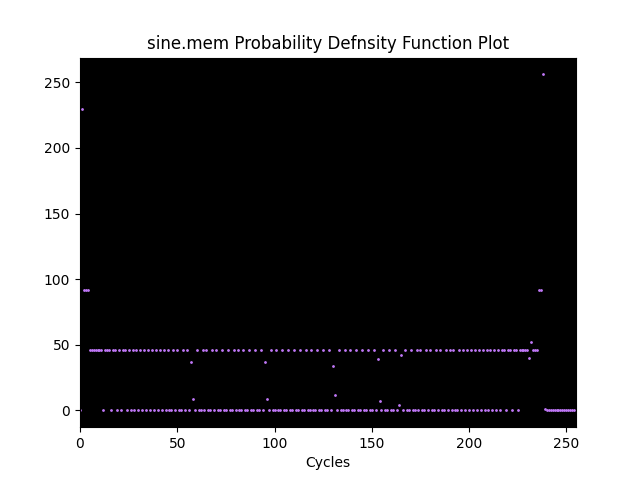
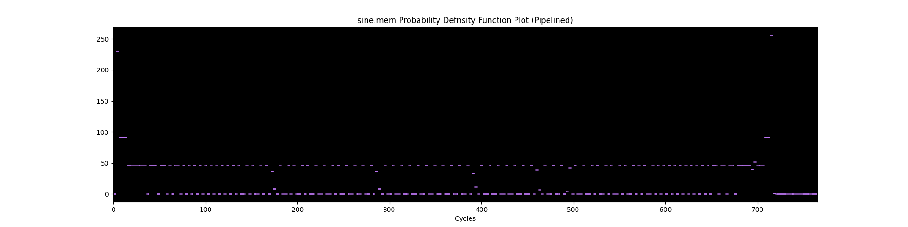

# Logbook: Results Verification

## Basic Info

* Author: Samuel Wang
* Date: 16 Dec 2022
* Objective: 
  * Analyse contents of reference program and explain what it does.
  * Simulate the results seen on vBuddy using the `vbdPlot()` function.

## Reference Program Analysis

Three main subroutines are observed within the reference program: 1) `init` -- "function to initialize PDF memory", 2) `build` -- "function to build probability density function", and 3) `display` -- "function to send value to a0 for display".

The `init` subroutine sets a block of memory to 0, starting from address 0x1FF to 0x100.

The `build` subroutine goes through the waveform stored in data memory, starting from 0x10000. Register `a2` denotes the location the subroutine is currently reading from. Value at (`a2` + `base_pdf`) is then loaded into `t0`, which is added to the `base_pdf` to give the location to increase the count of that value. This is then stored back to the address.

Note that the `build` subroutine does not go through all the value given in the data memory, but rather terminates when any of the count reaches the `max_count` variable, as evidenced in line 33. It is worth nothing that as a result the triangle waveform's PDF takes longer to generate, since it has mostly a straight line as a PDF and takes more data to reach the `max_count`.

The `display` subroutine loads the the data from 0x100 to 0x1FF into register `a0` for display. This is run continously until the set simulation cycle in the testbench is up.

## Simulate Results

To simulate what we might see if the reference program runs correctly on the vBuddy, a python script was written to emulate the behavior of the `build` subroutine. The `matplotlib` package was then used to plot the data in the build subroutine.

See the written script at [ipynb/pdf.ipynb](ipynb/pdf.ipynb), and a backup script in case Jupyter Notebook does not work at [ipynb/pdf.py](ipynb/pdf.py).

The PDF plot for pipelined versions of the processor is also simulated by duplicating the values for a certain number of cycles. This was due to the fact that the `addi` function in line 41 actually takes 4 cycles to complete to avoid data hazards in line 42. The longer dash of each data does not mean that the whole operation is slower, but rather that it takes more cycles to complete.

Here the simulation results for the sine waveform is linked. See Figures 1 and 2 below. For more simulation results see the [img](img) folder in docs or run the [python script](ipynb/pdf.ipynb).

|  |
| :-------------------------------------------------------: |
| Figure 1: Sine PDF (Single Cycle)                         |

|   |
| :-------------------------------------------------------: |
| Figure 2: Sine PDF (Pipelined)                            |

These diagrams are compared with what is displayed on the vBuddy to verify the correct PDF is generated.
